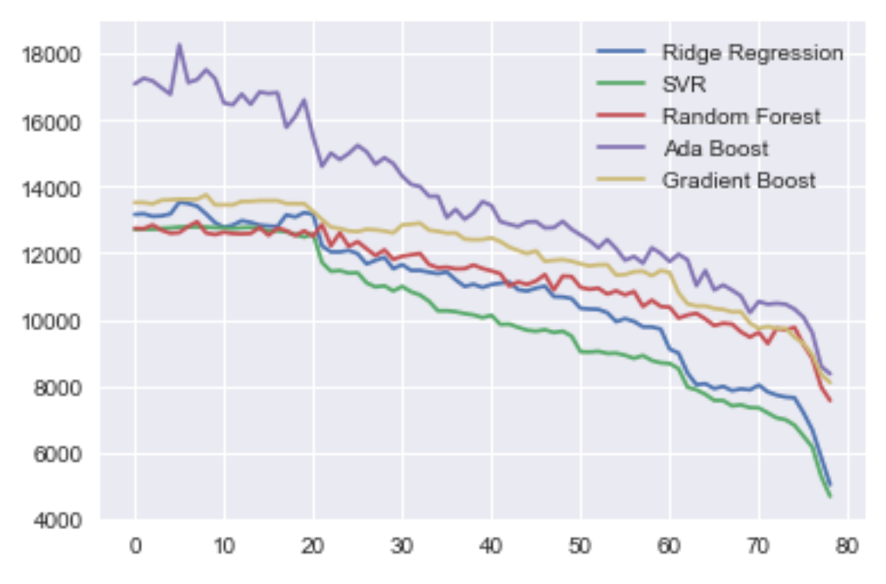

# Flight ticket sales prediction

## Summary of project

### Data Description

File ```sales_data.csv``` contains the information about a ticket sales for a plane departure over a year. Each observation in this dataset contains in order: plane departure date, a snapshot date before the departure marking the tickets sold by that date, and number of tickets sold for that flight by snapshot date. (The flight ticket sales begins 80 days before the departure date)

### Project description

Given the mentioned dataset we want to write a script capable of predicting the total ticket sales for a specific departure date based on current date. 

Here is a summary of what has been done for this project. First, by looking at some plots we can see that there's a significant change in people's ticket purchasing behaviour as we get close to the departure date (available within the exploration_notebook). This means that if the current_day (input to the predict function) is far away from the departure date the data is not sufficient to provide accurate predictions. Therefore, some kind of feature engineering is needed.

Before feature engineering, we transform the data into a pandas dataframe with 365 rows and 80 columns which can be fed into supervised learning algorithms as the training data matrix. Each row has the information for a specific departure date with tickets sold on each snapshot date.

Next, we would add some temporal metadata into our dataset to provide some added value and more data to provide more accurate predictions. These are the departure date characteristics. Things like whether it's the first or last day of a month/season. In addition we add what day of the week it is (Monday to Sunday) and also which month the departure is in (Jan-Dec) and what day of the month it is. By adding these features, it was observed that the quality of predictions improve (using 10-fold cross validation).

Before the training we use min max scaling so that all the predictors be in the 0 to 1 range. 

Next, few different models have been selected and experimented with to see which one does provide more accurate results. Including Linear Regression, Lasso, Ridge regression, support vector regression, random forests, Gradient boosting regressors, Ada Boost regressor. In the first iteration Random forest provided the lowest 10-fold cross validation score. But the low performance in Support Vector Regressor was probably because of the ordinal values of weekday (0-6) or month (1-12). To check this matter one hot encoding was done on these features. After the second round of model selection Support Vector Regressor shown to be the best performing model with the lowest mean squared error and that's the model selected to be used in the predict script.

Finally, based on the data it was observed that before the departure date 79 snapshot sales are available. The logic of the predict script is that it would train 79 different models for the each of the past 79 days before a departure. for example a model for the a snapshot 20 days away from the departure only uses the first 60 snapshots for training and also expects 60 values later on for predictions (in cases where current date is 20 days away from departure). Each of these models will get persistent on the hard drive for later extraction. That's why the first time that you would run the script the logs printed show that 79 lines each containing the 10-fold cross validation of that model. And you can observe that as we get closer to the departure date (and so having more snapshot) the MSE decreases.

[To Do] Next step was to tune the models hyper parameter tuning using grid search but due to lack of time it wasn't done.

**Visualizing the performance of model**

From the following figure we can see that as we get closer and closer to the departure date by having more data all models have lower and lower MSE in 10-fold cross validation. But SVR perfoms the best in general and it's the model selected for the actual training and prediction.




## Files included

README.md - this file!

requirements.txt - python packages required in order to be able to run the script

exploratory_notebook.ipynb - jupyter notebook that contains a part of explorations done on the data and some findings

predict.py - script for training the models and predicting ticket sales for a departure date with data observed up to a date (current_date)

## Setup and run

You need python 3 to run this code. First the requirements should be installed. You can use pip to install the required python packages.

`pip install -r requirements.txt`

### run (training phase)

In order to run this script the training data (sales_data.csv) should be in the same directory. You can then run script now, but without providing arguments only the training phase will get done.

`python predict.py`

After the training phase two directories will get created: models and preprocessing. models contain the presistent models (in this case 79 different models to be used later on based on the current day provided) to be used later on for predictions. preprocessing contains 79 different min max scalers trained based on the training data, again to be extracted later for preprocessing the unforseen data. In order to force execute the training phase, models and preprocessing directories should get deleted first.

### run (prediction phase)

To predict on new data based on the trained models 3 arguments should be to the predict script. Departure date, current date, and the path to data for prediction. Data should be of the same format as the training data (csv file with 2 columns: departure date, snapshot date) Example:

`python predict.py 2017-02-01 2017-01-10 sales_data.csv`

By running the previous command the script actually only extracts data for that departure date, and uses the data up to the current date (58 days logged, 22 away from the departure) for prediction. On the last line the scripts prints the estimated number of tickets to be sold for the given departure date rounded to the closes integer:

`INFO:root:Estimated tickets to be sold for departure date 2017-02-01 -> 374.0`